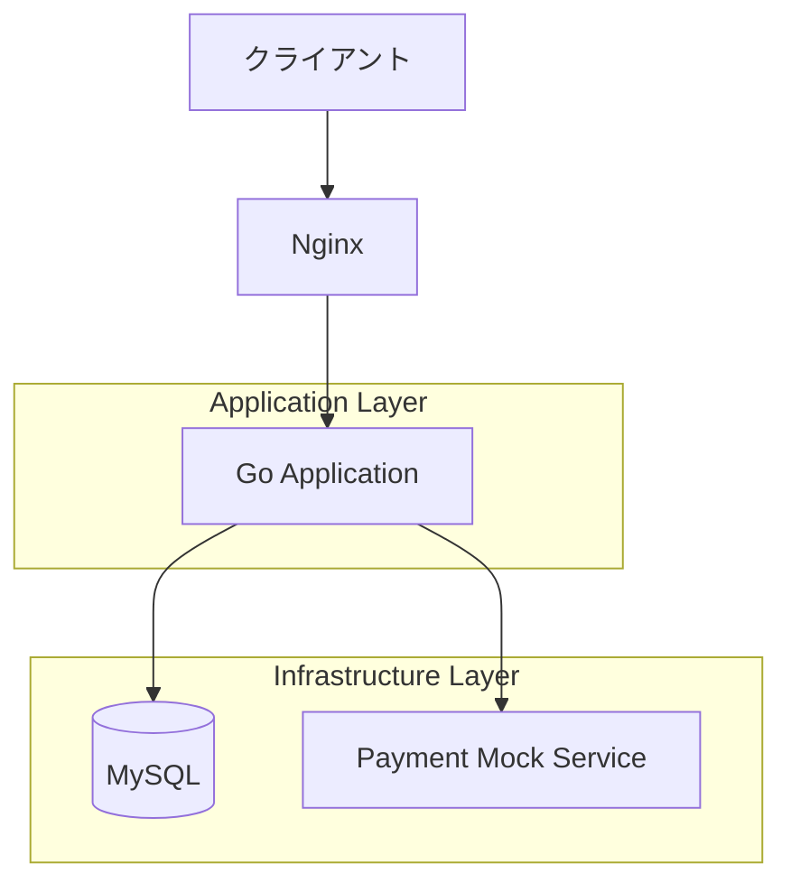
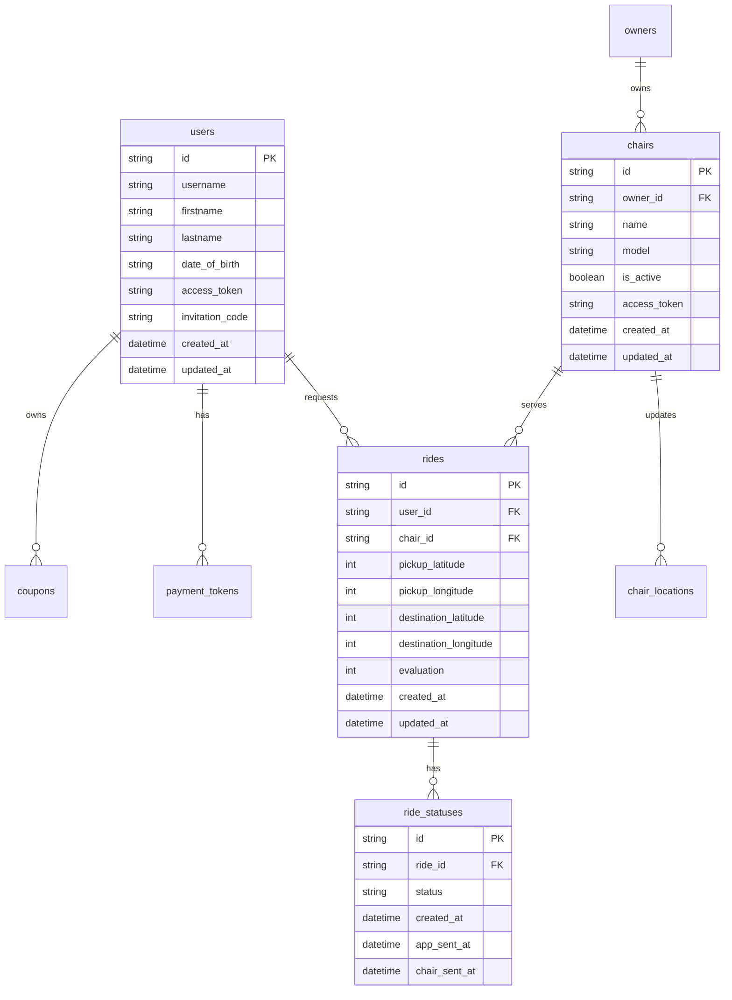
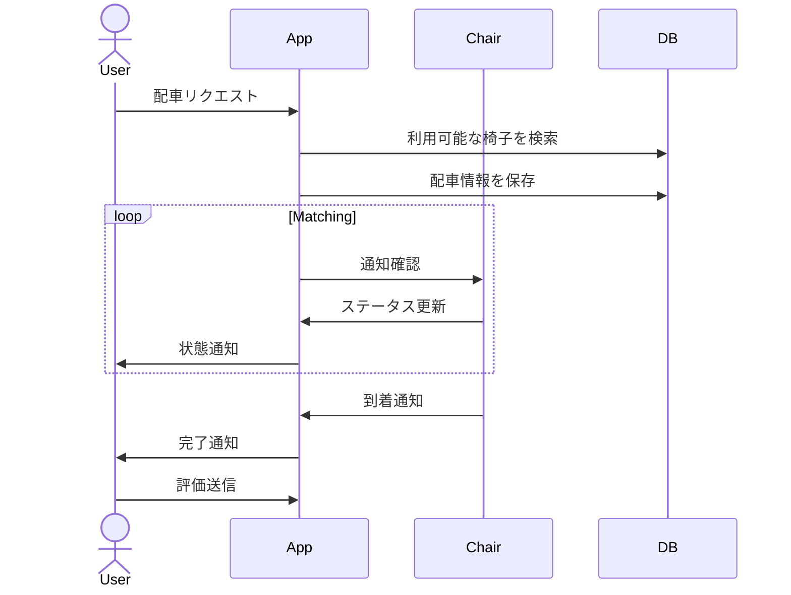
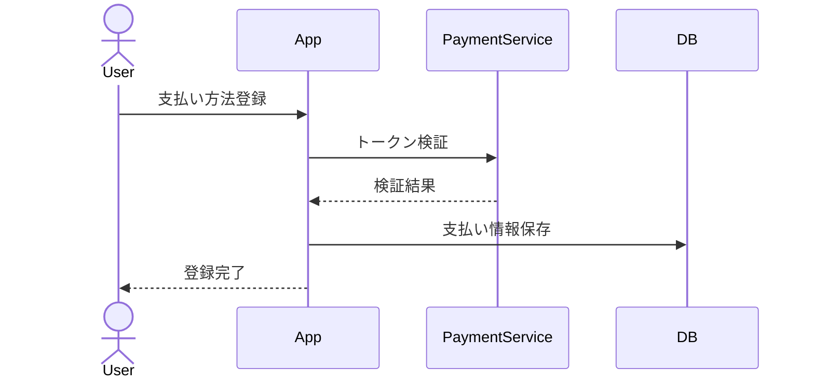

# ISU RIDE Application

## システム構成

### 依存サービス
- MySQL: メインデータベース
- nginx: Webサーバー/リバースプロキシ
- payment_mock: 決済モックサービス (port: 12345)

### アプリケーションアーキテクチャ
- 言語: Go
- フレームワーク: chi router

### システム構成図



## データ構造

### ER図


### 主要エンティティ
1. User
   - ユーザー情報
   - 認証情報
   - 支払い方法

2. Chair
   - 椅子情報
   - 位置情報
   - 稼働状態

3. Ride
   - 配車情報
   - 料金
   - 評価

4. Owner
   - オーナー情報
   - 椅子管理

## アプリケーションフロー

### 配車リクエストフロー


### 決済フロー


## API エンドポイント

### ユーザー向けAPI (/api/app/*)
- POST /users - ユーザー登録
- POST /payment-methods - 支払い方法登録
- GET /rides - 配車履歴
- POST /rides - 配車リクエスト

### オーナー向けAPI (/api/owner/*)
- POST /owners - オーナー登録
- GET /sales - 売上確認
- GET /chairs - 椅子一覧

### 椅子向けAPI (/api/chair/*)
- POST /chairs - 椅子登録
- POST /activity - 稼働状態更新
- POST /coordinate - 位置情報更新

### 内部API (/api/internal/*)
- GET /matching - 配車マッチング

## 監視設定

### nginxログ
- フォーマット: JSON
- 出力先: /var/log/nginx/access.log
- 主要フィールド:
  - time: リクエスト時刻
  - method: HTTPメソッド
  - uri: リクエストURI
  - status: ステータスコード
  - request_time: リクエスト処理時間

```
cp /etc/nginx/nginx.conf misc/nginx/nginx.conf
```
