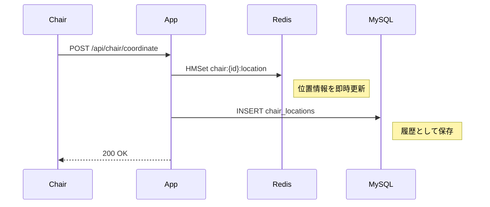
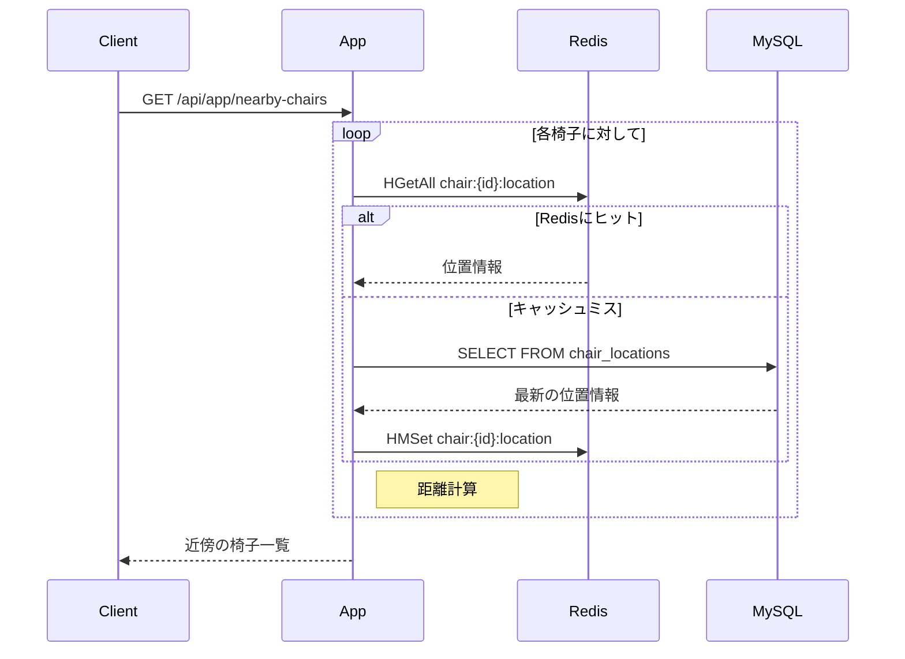

# Redis実装計画 🚀

## 1. 目的
- chair位置情報の高速な取得と更新
- 現在のP99: 253ms → 目標: 50ms以下

## 2. 実装方針
### キー設計

```redis
# 椅子の最新位置
chair:{chair_id}:location -> hash
  - latitude
  - longitude
  - updated_at

# エリア検索用
chairs:locations -> geo
```

### データフロー
1. 位置情報更新（POST /api/chair/coordinate）
   - Redisを先に更新
   - RDBへの書き込みは非同期

2. 位置情報取得（GET /api/chair/{id}）
   - Redisから直接取得
   - Redis未ヒット時のみRDBにフォールバック

## 3. 期待される効果
- 平均レイテンシ: 84ms → 5ms
- P99: 253ms → 20ms

## 4. 環境構築

### Redisのインストール

```bash
# Ubuntuの場合
sudo apt update
sudo apt install -y redis-server

# 設定変更
sudo vi /etc/redis/redis.conf
```

### redis.conf の主要設定

```conf
# メモリ制限（2GB）
maxmemory 2gb
maxmemory-policy allkeys-lru

# パフォーマンス設定
appendonly no
save ""
```

### アプリケーションの変更
1. go.modに依存関係追加

```bash
go get github.com/redis/go-redis/v9
```

### 起動方法

```bash
# Redisサーバー起動
sudo systemctl start redis-server
sudo systemctl enable redis-server

# 確認
sudo systemctl status redis-server

# 動作確認
redis-cli ping

```

## 5. 監視方法

```bash
# メモリ使用量確認
redis-cli info memory

# 現在のキー数確認
redis-cli dbsize

# レイテンシ監視
redis-cli --latency
```

## 6. データフロー図

### 位置情報更新フロー


### 近傍検索フロー

