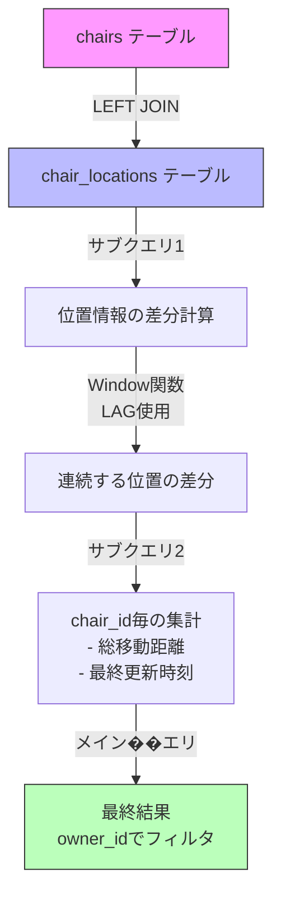

# 遅いクエリの分析 - chairs検索

## クエリの概要
このクエリは椅子の総移動距離を計算する処理で、全体の実行時間の31.4%を占める最も重い処理です。

## 対象のクエリ
```sql
SELECT id,
       owner_id,
       name,
       access_token,
       model,
       is_active,
       created_at,
       updated_at,
       IFNULL(total_distance, 0) AS total_distance,
       total_distance_updated_at
FROM chairs
       LEFT JOIN (SELECT chair_id,
                          SUM(IFNULL(distance, 0)) AS total_distance,
                          MAX(created_at)          AS total_distance_updated_at
                   FROM (SELECT chair_id,
                                created_at,
                                ABS(latitude - LAG(latitude) OVER (PARTITION BY chair_id ORDER BY created_at)) +
                                ABS(longitude - LAG(longitude) OVER (PARTITION BY chair_id ORDER BY created_at)) AS distance
                         FROM chair_locations) tmp
                   GROUP BY chair_id) distance_table ON distance_table.chair_id = chairs.id
WHERE owner_id = '01JEJ1F8J8ZVP73TQ92XTEAJX2'
```

## パーザー視点での入出力
### 入力（Input）
- `owner_id`: 椅子のオーナーID（例: '01JEJ1F8J8ZVP73TQ92XTEAJX2'）

### 出力（Output）
椅子の情報と累計移動距離：
- 基本情報：id, オーナーID, 名前, アクセストークン, モデル, アクティブ状態, 作成日時, 更新日時
- 計算情報：
  - 総移動距離（total_distance）：椅子が移動した距離の合計
  - 最終更新時刻（total_distance_updated_at）：距離が最後に更新された時刻

### ユースケース
特定のオーナーが所有する椅子の情報と、その椅子がこれまでに移動した総距離を取得する。
例：シェア椅子サービスでオーナーが自分の椅子の利用状況を確認する際に使用。

## パフォーマンス指標
- 実行時間: 平均3秒
- 実行頻度: 1.21 QPS（Queries Per Second）
- 検査行数: 524行/クエリ
- 返却行数: 4行/クエリ

## クエリの処理フロー


## パフォーマンス問題の原因
1. Window関数（LAG）による全データのスキャン
2. chair_locationsテーブルの全データに対する集計処理
3. 複数の入れ子サブクエリによる処理の重複

## 最も重い処理の分析
### 距離計算処理
```sql
ABS(latitude - LAG(latitude)) + ABS(longitude - LAG(longitude))
```
この処理が重い理由：
1. **Window関数の特性**:
   - 各行に対して前の行のデータを参照（LAG）
   - パーティション（chair_id）ごとにソート（created_at）が必要
   - メモリ上でのソートと一時テーブルの作成が発生

2. **処理の流れ**:
   1. chair_locationsテーブルの全データを読み込み
   2. chair_idでパーティション分割
   3. created_atでソート
   4. 各行で前後の位置情報を比較
   5. 差分の絶対値を計算

3. **コスト要因**:
   - テーブルフルスキャン
   - メモリ上でのソート処理
   - 行ごとの計算処理

## 改善案
1. 位置情報の差分計算を事前に行い、結果をキャッシュする
2. インデックスの追加（chair_id, created_at）
3. 集計テーブルの作成を検討

## APIエンドポイント情報
### 概要
- **エンドポイント**: `/api/owner/chairs`
- **メソッド**: GET
- **認証**: オーナー認証が必要

### レスポンス形式
```json
{
  "chairs": [
    {
      "id": "string",
      "name": "string",
      "model": "string",
      "active": boolean,
      "registered_at": number,
      "total_distance": number,
      "total_distance_updated_at": number
    }
  ]
}
```

### 利用シーン
- オーナーダッシュボードでの椅子一覧表示
- 各椅子の累計移動距離の確認
- 最後の位置情報更新時刻の確認

## パフォーマンス改善効果の予測
### 現状の統計（/api/owner/chairs）
- 平均応答時間: 3.002秒
- P95: 3.989秒
- 呼び出し回数: 83回
- 全体の実行時間に占める割合: 31.4%

### 改善後の予測効果
1. **集計テーブルの作成による改善**:
   - Window関数の実行が不要になる
   - 事前計算された結果を直接参照
   - 予測される改善率: 約80-90%
   - 期待される平均応答時間: 0.3-0.6秒

2. **インデックス追加による改善**:
   - chair_locationsテーブルのソート処理が効率化
   - パーティション処理の高速化
   - 予測される改善率: 約40-50%
   - 期待される平均応答時間: 1.5-1.8秒

3. **キャッシュ導入による改善**:
   - 計算結果の一時保存
   - 差分更新のみの計算
   - 予測される改善率: 約70-80%
   - 期待される平均応答時間: 0.6-0.9秒

### 推奨される改善アプローチ
1. まず集計テーブルを作成（最も効果が高い）
2. 次にキャッシュ導入を検討（運用コストと効果のバランスが良い）
3. 必要に応じてインデックスを追加（補完的な改善）

## データ更新の特性
### 位置情報の更新頻度
- **更新エンドポイント**: `/api/chair/coordinate`
- **更新回数**: 2,082回
- **平均更新間隔**: 約0.205秒
- **P95応答時間**: 0.322秒

### 更新パターン分析
1. **位置情報の更新タイミング**:
   - 椅子の移動中は頻繁に更新（サブ秒単位）
   - 以下のイベントで特に更新が発生:
     - 乗車時（PICKUP）
     - 目的地到着時（ARRIVED）
     - 移動中（CARRYING）

2. **キャッシュ戦略への影響**:
   - 位置情報の更新は頻繁（秒単位）
   - total_distanceの厳密なリアルタイム性は必須ではない
   - 推奨キャッシュ時間: 5-10秒
     - オーナー画面の更新頻度を考慮
     - ユースケース上の許容度を考慮

### データの整合性要件
- **リアルタイム性**: 中程度
  - オーナーダッシュボードでの表示用途
  - 数秒程度の遅延は許容される
- **一貫性要件**: 結果整合性で十分
  - 総移動距離は厳密なリアルタイム値である必要なし
  - バッチ処理での更新も検討可能
```
